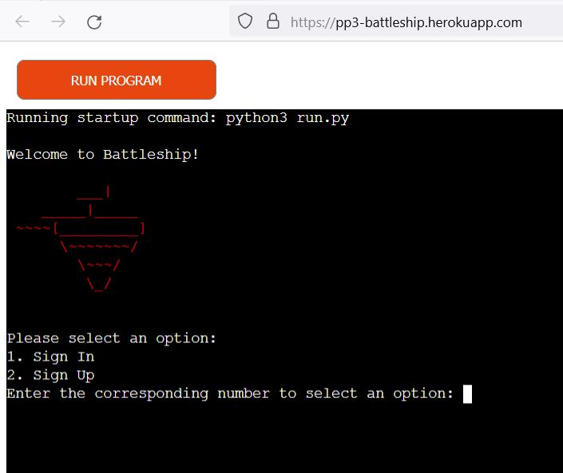
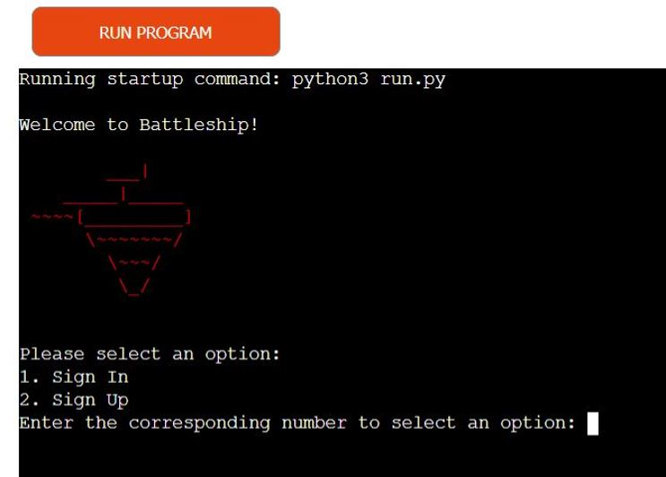

# Battleship Game 
(Developer: Jeremie Sandot)

[View live site](https://pp3-battleship.herokuapp.com/)

## Table of Contents

1. [Project Goals](#project-goals)
    1. [User Goals](#user-goals)
    2. [Site Owner Goals](#site-owner-goals)
2. [User Experience](#user-experience)
    1. [Target Audience](#target-audience)
    2. [User Stories](#user-stories)
    3. [Scope](#scope)
    4. [User Manual](#user-manual)
3. [Technical Design](#technical-design)
    1. [Flowchart](#flowchart)
    2. [Data Models](#data-models)   
4. [Technologies Used](#technologies-used)
    1. [Languages](#languages)
    2. [Frameworks and Tools](#frameworks-and-tools)
5. [Features](#features)
6. [Testing](#validation)
    1. [Python Validation](#Python-validation)
    2. [Testing user stories](#testing-user-stories)
8. [Bugs](#Bugs)
10. [Deployment](#deployment)
11. [Credits](#credits)
12. [Acknowledgements](#acknowledgements)

## Project Goals 

- Develop a Battleship game that can be played on the command line.
- Implement an authentication system using Google Sheets API to allow players to log in. 
- Create a Board class to represent the game board.
- Implement a function to randomly place ships on the computer's grid.
- Create methods to mark the ships on the board, check if a location has a ship, and to fire a shot at a location.

### User Goals
- Authenticate the user with the correct username and password, preventing unauthorized access.
- Play the game of Battleship with a player and a computer, place and track the location of       ships, and mark successful hits and misses on the board.
- Provide user feedback and error messages for invalid inputs or actions, helping the user to understand how to interact with the program correctly.

### User Goals
- Provide an engaging and enjoyable gameplay experience: 
- Provide an interface to allow players to log in to the game.
- Allow the player to play against AI

## User Experience

### Target Audience
- Individuals who like board games, strategy games, or games that involve logic and decision-making
- Individuals who are interested in coding.

### User Stories

#### First-time User 
1.	As a new player, I want to be able to sign up so that I can play Battleship.
2.	As a registered player, I want to be able to sign in so that I can start a new game.
3.	As a player, I want to be able to rely on AI to mark my ships on the board so that I can start the game.
4.	As a player, I want to be able to fire missiles at my opponent's board so that I can win the game.
5.	As a player, I want to be able to see the result of each turn so that I can keep track of the game.
6.	As a player, I want to be able to choose the size of the board so that I can customize the game.

#### Site Owner
7.	As the game owner, I want to implement a feature that prevents players from entering invalid usernames or passwords to prevent unauthorized access.
8.	As the game owner, I want to implement a feature that prevents players from entering board sizes that are too small or too large to ensure that the game is fair and playable.
9.	As the game owner, I want the application to be user friendly.
10.	As the game owner, I want to implement a feature that allows players to play against a computer AI so that they can practice and improve their skills.
11.	As the game owner, I want to implement a feature that keeps track of the game's progress and displays the winner once the game is over so that players can see who won.
12. As a site owner I want the game to be playable on multiple devuices.

### User Manual

#### Overview

- This application is a command-line implementation of the popular game "Battleship". It allows two players, a human and a computer, to play against each other. The game is played on two separate 5x5 grids, one for each player. The grids are initially empty and players take turns firing missiles at each other's grids in an attempt to sink each other's ships.

The application provides the user with prompts and menus to select the game mode, enter their username and password to login, place their ships on their grid, and fire missiles at their opponent's grid. The user can see their own grid and the shots they have made on their opponent's grid. The application also validates input and checks for errors before proceeding to the next step. The game ends when one of the players has sunk all of the ships of their opponent.

#### Main Menu

- On the main menu you will be provided with 2 options

1. Sign In : this option is for already registered users. Upon validation of their credentilas (username and password ) a user gains access to the application.

2. Sign up : This option allows a user who has never played this game to create a username and a password. 

#### Sign In Option

- If a user selects the option 1 "Sign in" in the battlefield game, the login function will be called. The user will be prompted to enter their username and password. 

- The function will first validate that the username and password are not empty and have at least 5 characters. 

- Then, it will authenticate with Google Sheets using the authenticate function, and retrieve the auth_dict worksheet. It will retrieve all rows in the worksheet as a list of dictionaries, and check if there's a row with the given username and password. 

- If the username and password match, the function will return True, indicating that the user has successfully signed in. 
- If the username and password don't match, the function will return False, indicating that the sign in failed.

#### Sign up Option
- The signup operation is used to create a new account on the system. In order to sign up, the user will need to provide a unique username and a password that meets certain requirements, such as being at least 5 characters long.
- When the user selects option 2 he is required to enter a username with minimum 5 characters
- if the user fails to meet the 5 charracter minimum they will get an error message (must be at least 5 characters)
- if the user tries to enter a blank username a warning will indicate that a username cannot be blank
- if the user meets all the criteria he is prompted to enter a password with at least 5 characters
- if the password is < 5 characters or baknk he gets a warning ( invalid password must be at least 5 characters )

### Game Page

- Upon sucessfull sign in the user is prompted to select 3 board sizes
    - 5x5
    - 6x6
    - 7x7 

## Technical Design

### Data models
- The data model used in the code consists of two classes, Board and Player.

- The Board class is responsible for initializing the game board, placing ships on the board, firing shots at the opponent's board, and displaying the game board to the user. The Board class has the following attributes:
    - size
    - grid
    - ships
    - computer_ships
    - player_name
    - board_type

- The Board class has the following methods:

    - __init__(self, size, player_name, board_type): initializes the Board object.
    - __str__(self): returns a string representation of the board, which is printed when the board needs to be displayed.
    - mark_ship(self, x, y): adds a ship at a given position on the board.
    place_computer_ships(self): randomly places ships on the computer's board.
    - has_ship(self, x, y): returns True if there is a ship at a given position on the board.
    - is_valid(self, x, y): returns True if the given position is valid on the board.
    - fire(self, x, y): returns True if there is a ship at a given position on the board, otherwise False.
    - get_grid_coords(self, x, y): converts coordinates from the shot_grid to the grid.

- The Player class is responsible for the game logic and interaction with the user. The Player class has the following attributes:

    - board: a Board object representing the user's board.
    - shot_grid: a 2D list representing the user's shots on the computer's board.

- The Player class has the following methods:

    - __init__(self, size, player_name): initializes the Player object.
    - setup_board(self): prompts the user to mark their ships on the board.
    - play(self, computer_board): allows the user to play against the computer.

- Google sheets API.  JUSTIFICATION: I have chosen to use Google Sheets API so that the required data for the app will persist outside of the container.

## Technologies Used

### Languages

- [Python 3](https://www.python.org/)

### Frameworks and Tools

1. [Git](https://git-scm.com/) - Git was used for version control within VSCode to push the code to GitHub.
2. [GitHub](https://github.com/) - GitHub was used as a remote repository to store project code. 
5. [Google Sheets](https://www.google.co.uk/sheets/about/) - was used to store data outside of the program.  The vehicle catalogue and appraisal data stored in 2 separate sheets.
6. [Google Cloud Platform](https://cloud.google.com/cloud-console/) - was used to manage access and permissions to the google services, google auth, sheets etc.
7. [Heroku](https://www.heroku.com/about) - Was used to deploy, manage, and scale this apps.

## Features

### Main menu

Visualy pleasant welcome screen, Interactive Menu Prompt the user to either signup or sign in 
user story covered 1,2,7

Main Menu

### Sign Up
Function to create new user's login credentials and saving them on the "auth_dict" worksheet. 
User stories covered 1,7

Sign Up

### Sign In
Function to validate the user's login credentials using the "auth_dict" worksheet. 
User stories covered 2,7

Sign Up

### Input Validation
Provides Feed back to the user : After user is logged in successfully, a welcome message is displayed
User story covered 7

